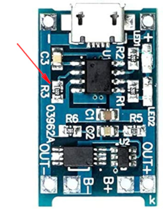

# KaRC

## Dependencies
- AutoConnect Library https://github.com/Hieromon/AutoConnect
- HX1230_FB Library https://github.com/cbm80amiga/HX1230_FB
- OneButton Library https://github.com/mathertel/OneButton
## BOM
- HX1230 Display http://chip69.ru/catalog/108689
- Wemos D1 Mini https://aliexpress.ru/item/32651747570.html
- 1x4 buttons 5 pins board https://aliexpress.ru/item/32886402552.html
- TC4056 module https://aliexpress.ru/item/32825983420.html
- BL5C battery https://aliexpress.ru/item/1005002239609662.html
- Paper clips brass plated https://www.erichkrause.com/en/catalog/Paper_clips_105/paper_clips_brass_plated_erichkrause_28mm_plastic_box_200_pcs_19739/
## Assembly 
### Wemos

Replace the 220kOhm resistor on the circuit board of the Wemos D1 Mini with a 510kOhm resistor.  
Connect pin A0 to pin 5v.
### Display
RST -> D3  
CS -> D8  
DIN -> D7  
CLK -> D5  
VCC -> VCC  
BL -> D6  
GND -> GND
### Buttons
K1 -> D4  
K2 -> D2  
K3 -> D1  
K4 -> RST  
GND -> GND
### TC4056 module

Replace the 1.2kOhm resistor on the TC4056 module with a 3kOhm resistor.
B- -> Batt-  
B+ -> Batt+  
OUT- -> GND  
OUT+ -> 5V
## Known issues
